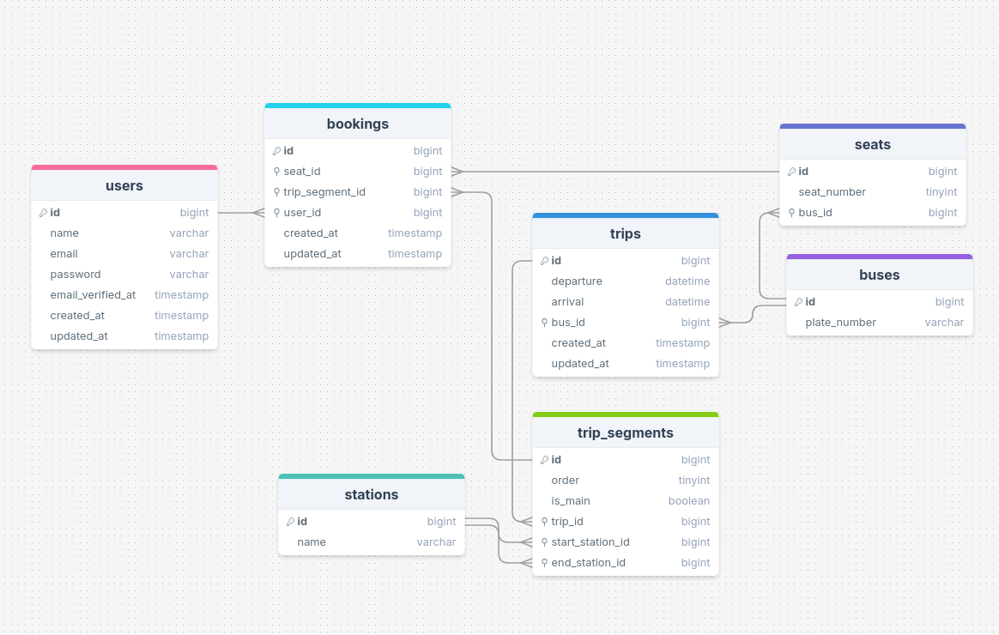

# Fleet Management System
This is a fleet-management system (bus-booking system) built using the Laravel framework. The project allows users to book bus seats for predefined trips between various cities, including handling different segments of a trip and ensuring no overlapping bookings.

## Getting Started

### Prerequisites
- Docker
- Git

### Installation
1. Clone the repostory:
    ```bash
    git clone git@github.com:m-atalla/fleet.git
     cd fleet
    ```
1. Run the initialization script:
    ```bash
    sudo chmod +x ./init.sh
    ./init.sh
    ```
    The `init.sh` will do the following: 
    - Initialize environment variables
    - Install dependencies with composer
    - Start the Docker containers via Laravel Sail
    - Generate The application key
    - Run database migrations and seeds
    - Generate API documentation using Scribe

## Database
The database schema is set up using Laravel migrations and seeds. It includes tables for:
- Stations: Listing all bus stations.
- Trips: Managing trips between stations.
- Trip Segments: Handling segments of trips.
- Buses: Listing available buses.
- Seats: Handling seat availability.
- Bookings: Managing user seat bookings.



## Running Tests
You can run the test suite using the following command:
```bash
./vendor/bin/sail test
```
